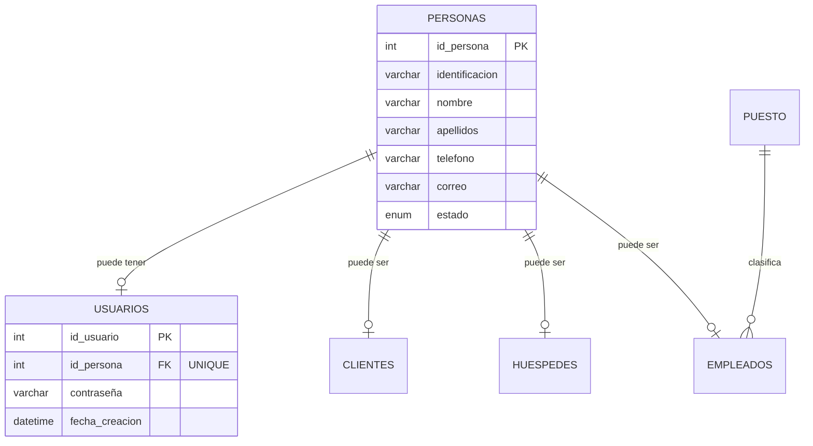

# DER actualizado — Dalssi Hotel

La única entidad agregada en esta etapa es `usuarios`.

```mermaid
erDiagram
    PERSONAS ||--o| USUARIOS : "puede tener"
    PERSONAS ||--o| CLIENTES : "puede ser"
    PERSONAS ||--o| HUESPEDES : "puede ser"
    PERSONAS ||--o| EMPLEADOS : "puede ser"
    PUESTO ||--o{ EMPLEADOS : "clasifica"

    PERSONAS {
        int id_persona PK
        varchar identificacion
        varchar nombre
        varchar apellidos
        varchar telefono
        varchar correo
        enum estado
    }

    USUARIOS {
        int id_usuario PK
        int id_persona FK "UNIQUE"
        varchar contraseña
        datetime fecha_creacion
    }
```

La relación principal de autenticación es `PERSONAS 1 : 0..1 USUARIOS`.
